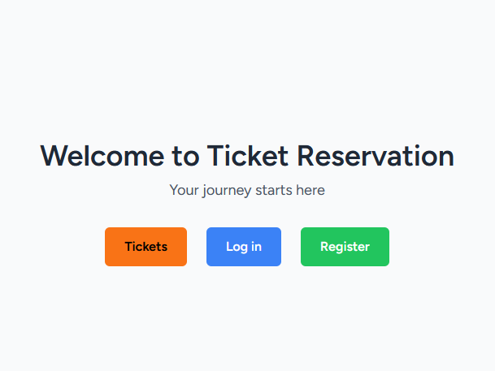
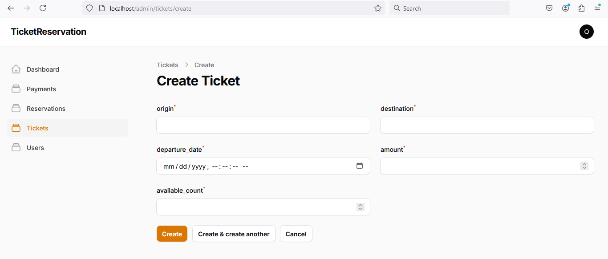
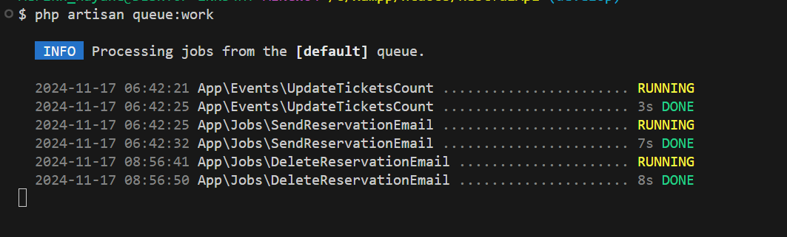
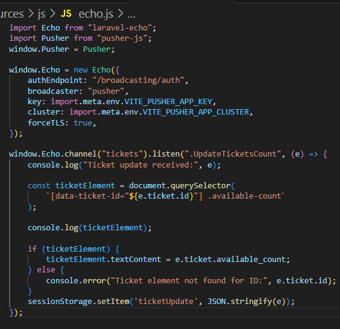
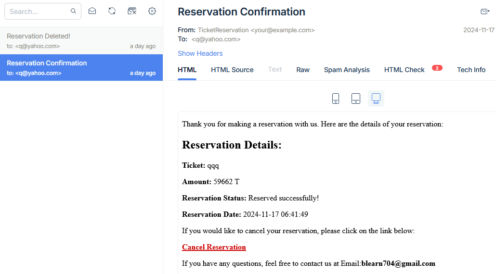
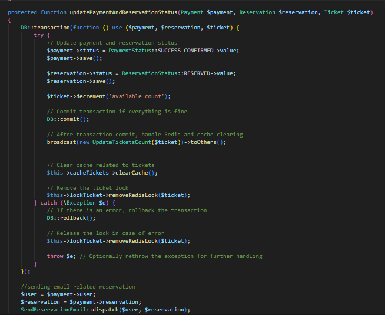

<p align="center">
    
</p>

<p align="center">
    <a href="https://github.com/Hamed042gh/ReservationTickets-with-User-Management/actions"></a>
    <a href="https://packagist.org/packages/your-project"></a>
    <a href="https://packagist.org/packages/your-project"></a>
    <a href="https://packagist.org/packages/your-project"></a>
</p>

---

## About the Project

This project is an online ticket reservation system built with **Laravel**. It provides efficient solutions for reserving tickets for events, integrating features such as real-time updates, payment systems, and robust user management.


---

### **Key Features:**

1. **Authentication**: 
   - Implemented with Laravel Breeze for simple and fast authentication.
   - User registration, login, and session management.

2. **Advanced Search**: 
   - Filters for searching tickets by **origin**, **destination**, and **date**.
   - Optimized search using **Redis caching** for better performance and fast results.

3. **Ticket Management**:
   - Full CRUD (Create, Read, Update, Delete) operations for tickets.
   - Built using **Filament** for an elegant admin interface to manage tickets.
   - Real-time ticket updates with **server-side broadcasting** and **Livewire**.

4. **Real-Time Updates**:
   - **WebSocket broadcasting** with **Pusher** for live ticket updates, allowing users to view ticket status changes in real-time.
   - Integration of **Laravel Echo** to enhance real-time functionality and improve user experience.

5. **Payment Integration**:
   - Integrated **Zibal payment gateway** to process online payments for ticket reservations.
   - Transaction handling and status updates are managed via background jobs.

6. **Queue Management**:
   - Robust **background job processing** with **Laravel queues** to handle tasks like sending email notifications, processing reservations, and managing payments.
   - **Redis caching** and **failed job retries** for enhanced reliability and performance.

7. **Email Support**:
   - Reservation confirmation and cancellation emails sent automatically using **Laravel Mail**.

8. **Admin Role & Middleware**:
   - Implemented an **admin role middleware** to restrict access to certain routes and views for admin users.

9. **Data Migrations and Factories**:
   - Integrated **Eloquent migrations** to handle database schema changes seamlessly.
   - Used **Factories and Seeders** for generating test data for users, reservations, and tickets.

10. **Reservation Management**:
   - Users can easily reserve tickets with a **real-time available seat checker**.
   - Added features for **reservation cancellation** and email notifications using job dispatching.

11. **Job and Event Broadcasting**:
   - **Job processing** for background tasks such as payment verification and reservation status updates.
   - **Event broadcasting** using **Laravel broadcasting** and **Pusher** for real-time notifications.

12. **Laravel Telescope Integration**:
   - Integrated **Laravel Telescope** for application monitoring and debugging.
   - Helps in tracking queries, jobs, and requests for performance improvements.

13. **Database Optimizations**:
   - **Redis** used for caching ticket data and improving page load times.
   - Optimized **database queries** and pagination for better performance.

14. **UI/UX Improvements**:
   - Enhanced user interface for ticket booking and reservation.
   - Integrated **Breeze** for simple, modern authentication interfaces.

15. **User Management**:
   - **Admin panel** built with **Filament** for efficient user management.
   - Ability to manage user roles, reservations, and ticket statuses directly from the dashboard.

---

## Project Screenshots


### User Management


### Queue Worker


### Websocket


### Reservation Email


### Atomic functions


---

## Installation and Setup

1. **Clone the repository**:
   ```bash
   git clone https://github.com/Hamed042gh/ReservationTickets-with-User-Management.git
   cd ReservationTickets-with-User-Management
